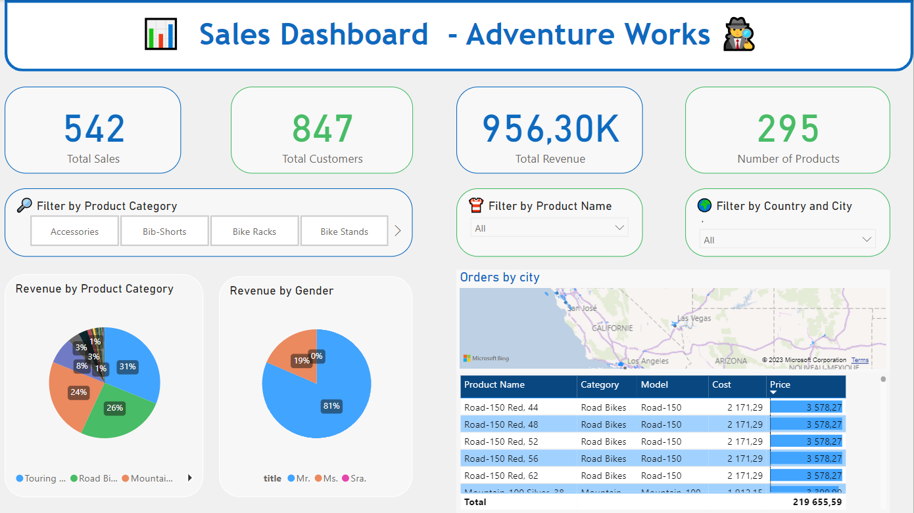

<!--   <a href="https://lookerstudio.google.com/reporting/da5da0af-4be0-4f7d-a84b-f7c2892df612"> -->
    
  </a>

  

    <ul>
      
<h1 style="display: inline-block;"> Analyzing Sales of AdventureWorks </h1>

    </ul>
  

  
  
On-prem DB to Azure Cloud Pipeline with Data Factory, Lake Storage, Spark, Databricks, Synapse, PowerBI

 

## 📝 Table of Contents
1. [Project Overview](#introduction)
2. [Key Insights](#key-insights)
3. [Project Architecture](#project-architecture)  
  3.1. [Data Ingestion](#data-ingestion)  
  3.2. [Data Transformation](#data-transformation)  
  3.3. [Data Loading](#data-loading)  
  3.4. [Data Reporting](#data-reporting)
4. [Credits](#credits)
5. [Contact](#contact)

## 🔬 Project Overview 

This an end-to-end data engineering project on the Azure cloud. Where I did data ingestion from a on-premise SQL Server to Azure Data Lake using Data Factory to transformation using Databricks and Spark, loading to Synapse, and reporting using PowerBI. Also, I used Azure Active Directory (AAD) and Azure Key Vault for the data monitoring and governance purpose. 

### 💾 Dataset

**AdventureWorks** is a database provided by Microsoft for free on online platforms. It is a product sample database originally published by Microsoft to demonstrate the supposed design of a SQL server database using SQL server 2008. Here are some key points to know about AdventureWorks:

- AdventureWorks database supports a manufacturing MNC named Adventure Works Cycles.
- It is a sample Online Transaction Processing (or OLTP) database, which is a type of data processing where multiple transactions occur concurrently. These are shipped by Microsoft with all of their SQL server products.

> For this project I used the **Lightweight (LT) data**: a lightweight and pared down version of the OLTP sample. [Download here](https://github.com/Microsoft/sql-server-samples/releases/download/adventureworks/AdventureWorksLT2022.bak)

### 🎯 Project Goals

- Establish a connection between on-premise Postgre server and Azure cloud.
- Ingest tables into the Azure Data Lake.
- Apply data cleaning and transformation using Azure Databricks.
- Utilize Azure Synapse Analytics for loading clean data.
- Create interactive data visualizations and reports with Microsoft Power BI.
- Implement Azure Active Directory (AAD) and Azure Key Vault for monitoring and governance.

## 🕵️ Key Insights

- 💸 **Total Revenue by Product Category**
  - *Touring Bikes* is the top 1 category generating revenue with 32% followed by *Road Bikes* with 26% and *Mountain Bikes* with 24%.
 
- 🌍 **Sales by Country**
  - **N°1:** The United Kingdom (UK) have the most total sales with 278 and $572,000 of total revenue.
  - **N°2:** The United States of America (USA) is second with total sales with 264 and $383,810 of total revenue.

- 🚻 **Revenue by Gender**
  - 81% of the revenue is generated by Male customers
  - 19% of the revenue is generated by Female customers  

> This can be explained by males have more interest in doing outdoor activites with the different categories of Bikes than females.

## 📝 Project Architecture

You can find the detailed information on the diagram below:

### 📤 Data Ingestion
- Connected the on-premise SQL Server with Azure using Microsoft Integration Runtime.

- Migrated the tables from on-premise Postgre Server to Azure Data Lake Storage Gen2.

### ⚙️ Data Transformation
- Mounted Azure Blob Storage to Databricks to retrieve raw data from the Data Lake.
- Used Spark Cluster in Azure Databricks to clean and refine the raw data.
- Saved the cleaned data in a Delta format; optimized for further analysis.

### 📥 Data Loading
- Used Azure Synapse Analytics to load the refined data efficiently.
- Created SQL database and connected it to the data lake.

### 📊 Data Reporting
- Connected Microsoft Power BI to Azure Synapse, and used the Views of the DB to create interactive and insightful data visualizations.

### 🛠️ Technologies Used

- **Data Source**: PostgreSQL
- **Orchestration**: Azure Data Factory
- **Ingestion**: Azure Data Lake Gen2
- **Storage**: Azure Synapse Analytics
- **Authentication and Secrets Management**: Azure Active Directory and Azure Key Vault
- **Data Visualization**: PowerBI
